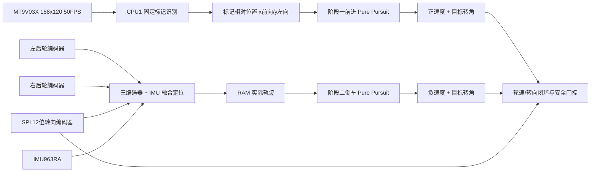

# TC387 引导标记前进与实际轨迹倒车实施计划

版本日期：2026-08-17  
适用工程：`Seekfree_TC387_Opensource_Library`  
当前分支：`agent/tc387-vehicle-control`  
记录基线：`75cea4222977bf2a50799e2d6844b81a9d4520ba`

## 1. 需求定义

车辆前方没有赛道、道路边界或地面中心线。阶段一唯一的视觉引导目标是前方引导员背上的固定标记。

最终控制流程如下：

1. 阶段一：相机识别引导员背部标记，计算标记相对车辆的位置，以标记位置生成前进 Pure Pursuit 的局部目标点；车辆前进速度始终为正。
2. 阶段一行驶期间：使用左后轮编码器、右后轮编码器、新 SPI 转向绝对编码器和 IMU 融合定位，把车辆实际走过的 `x/y/yaw/speed` 轨迹记录在 RAM 中。
3. 阶段二：读取 RAM 中阶段一记录的实际轨迹，从终点向起点倒序跟踪，使用倒车 Pure Pursuit；车辆倒车速度始终为负。
4. 阶段切换时不重置定位坐标。阶段二跟踪的是车辆实际走过的路径，不是引导员的轨迹，也不是相机中的视觉连线。

本计划只描述代码实现工作和实施顺序，不包含主机测试、台架测试、实车测试、验证或验收任务；这些工作由用户自行完成。

## 2. 传感器用途和符号约定

新编码器安装在转向减速齿轮箱输出侧，按“转向输出轴绝对角度传感器”使用。

- 左后轮编码器：左后轮位移和速度。
- 右后轮编码器：右后轮位移和速度。
- 新 SPI 编码器：转向机构实际输出角，不参与车辆行驶距离求平均。
- IMU：横摆角速度、加速度和短时运动状态。

统一坐标和符号：

- 车体坐标系 `x` 向前，`y` 向左。
- 航向角和横摆角速度逆时针为正。
- 等效前轮转角左转为正、右转为负。
- 阶段一中心速度严格限制为 `v >= 0`，有效行驶命令为 `v > 0`。
- 阶段二中心速度严格限制为 `v <= 0`，有效行驶命令为 `v < 0`。
- 编码器原始计数增加方向不作假设，通过实测标定表转换为统一转角符号。

## 3. 硬件连接固定方案

新编码器使用原理图 P5 的六根线。四根信号线刚好构成 TC387 的 SPI1 硬件接口，不再保留 MT6701 AB/TIM5 方案。

| 编码器信号 | TC387 引脚 | 配置 |
|---|---:|---|
| SCLK | P10.2 | `SPI1_SCLK_P10_2` |
| MISO | P10.1 | `SPI1_MISO_P10_1` |
| MOSI | P10.3 | `SPI1_MOSI_P10_3` |
| CS | P10.5 | `SPI1_CS9_P10_5` 或软件控制 GPIO CS |
| VCC | 原理图 P5 VCC | 3.3 V |
| GND | 原理图 P5 GND | 系统地 |

编码器已知规格：

- 360°绝对角度。
- 12 位输出，范围 `0..4095`。
- 分辨率约 `0.088°/count`。
- SPI Mode 0：`CPOL=0，CPHA=0`。
- 数据更新周期 1 us。
- 3.3 V CMOS 输出。

逐飞库中的 `libraries/zf_device/zf_device_absolute_encoder.*` 与该器件规格相符：它以 SPI Mode 0 读取 16 位数据，再右移 4 位得到 12 位角度。车辆工程应复用它的协议流程，但不能直接使用其中硬编码的 SPI0/P20 引脚。

## 4. 最终软件数据流



## 5. 当前代码中可复用和需要替换的部分

### 5.1 可复用

- 相机 DVP、DMA、CPU1 图像处理入口和 CPU0/CPU1 共享快照。
- `vision_tag_tracker.*` 的固定 AprilTag 检测、中心位置、四角、尺寸、置信度和短时滤波。
- 两个后轮编码器采集和速度计算。
- IMU 读取、SI 单位转换和零偏框架。
- `vehicle_localization.*` 的左右后轮、IMU 和转向运动学三模型融合结构。
- `vehicle_path.*` 的 RAM 记录、重采样、平滑、弧长、曲率和合法性处理。
- `vehicle_reverse_tracker.*` 的倒序索引和倒车 Pure Pursuit。
- 轮速控制、转向位置控制、状态机、受控停车和故障门控。

### 5.2 必须替换或新增

- 删除正常车辆路径对 MT6701 AB/TIM5 的依赖，改成 SPI1 12 位绝对编码器。
- 将 `VehicleMt6701` 抽象为通用转向编码器类型，或新增独立 `VehicleSteeringEncoder`。
- `vehicle_perception.cpp` 当前把标记横向像素误差直接乘转向上限，必须改成“标记相对位置→前进 Pure Pursuit”。
- 新增标记距离和横向位置估算；只有图像中心偏差不能构成几何 Pure Pursuit。
- 新增阶段一前进 tracker，阶段二倒车 tracker 保持独立。
- 修正相机旧帧重复刷新控制命令的问题。

## 6. 第 1 步：新增 SPI 12 位转向编码器模块

建议新增：

- `code/vehicle_steering_encoder.h`
- `code/vehicle_steering_encoder.cpp`

并修改：

- `code/vehicle_hardware_config.h`
- `code/vehicle_hal.h`
- `code/vehicle_hal.cpp`
- `code/vehicle_types.h`

### 6.1 硬件配置修改

- 将转向传感器类型固定为 SPI 12 位绝对编码器。
- SPI 外设固定使用 `SPI_1`。
- SPI 模式固定使用 `SPI_MODE0`。
- 引脚固定为 P10.2/P10.1/P10.3/P10.5。
- 删除正常初始化流程中的 TIM5、A/B/Z/DIR 转向编码器配置。
- 保留旧 MT6701 文件作为历史参考时，确保它不再被 `vehicle_app` 或 HAL 初始化。

### 6.2 驱动接口

驱动至少提供：

```cpp
struct VehicleSteeringEncoderSample
{
    uint64_t timestamp_us;
    uint16_t raw_count;       // 0..4095
    int32_t relative_count;   // 相对机械中位的有符号模差
    int64_t continuous_count; // 用于诊断连续运动
    uint32_t communication_error_count;
    uint32_t jump_error_count;
    bool valid;
};
```

建议 API：

```cpp
void vehicle_steering_encoder_init(...);
bool vehicle_steering_encoder_read(uint64_t now_us,
                                   VehicleSteeringEncoderSample *sample);
int32_t vehicle_steering_encoder_delta12(uint16_t now, uint16_t previous);
bool vehicle_steering_encoder_is_fresh(uint64_t now_us, uint64_t timeout_us);
```

### 6.3 数据读取和解绕

- 参考逐飞绝对编码器驱动完成寄存器初始化、自检和两字节读取。
- 按协议读取 16 位数据，使用 `(frame >> 4) & 0x0FFF` 得到 12 位角度。
- 12 位连续模差规则：差值大于等于 `+2048` 时减 4096；小于 `-2048` 时加 4096。
- `continuous_count` 只用于连续诊断和运动方向，不作为上电绝对中位。
- 上电位置由固定的 `center_raw_count` 计算：

```text
relative_count = delta12(raw_count, center_raw_count)
```

- 这样即使原始角度跨越 4095/0，也能在机械转向范围小于半圈时得到稳定的有符号转向位置。
- 不再采用“第一次有效样本自动当中位”的旧逻辑。
- 对重复时间戳、通信异常、固定异常帧、过大单周期跳变和超时输出无效样本。
- SPI 调用必须有有界等待，传感器异常不能永久阻塞控制循环。

## 7. 第 2 步：重构转向标定和转向闭环输入

修改：

- `code/vehicle_calibration.h`
- `code/vehicle_calibration.cpp`
- `code/vehicle_control.h`
- `code/vehicle_control.cpp`

### 7.1 新增标定字段

- `steering_encoder_center_raw_count`：机械中位对应的绝对 12 位原始值。
- 左右软件限位对应的 `relative_count`。
- 从左侧接近目标时的 `relative_count -> equivalent_steering_angle_rad` 表。
- 从右侧接近目标时的同类表。
- 转向电机物理左转对应的 DIR 极性。
- 左转、右转最低有效启动占空比。

### 7.2 转角换算

- 先用 `center_raw_count` 得到相对计数。
- 再根据当前接近方向选择两张回差表之一。
- 查表输出统一的等效前轮转角：左正、右负。
- 控制器内部所有目标角、实测角、软限位和堵转判断都使用同一坐标。
- 原始 0.088° 是编码器轴角分辨率，不能直接当作等效前轮转角；最终关系由车辆转向机构实测表决定。

### 7.3 上电位置策略

绝对编码器固定安装后，中位原始值写入标定配置。系统每次上电直接根据绝对值恢复转向位置，不要求把当前首样本清零。若传感器或联轴器被拆装，必须重新更新中位、软限位和双向表。

## 8. 第 3 步：把定位明确为“三编码器 + IMU”融合

修改：

- `code/vehicle_localization.h`
- `code/vehicle_localization.cpp`
- `code/vehicle_app.cpp`
- 相关日志和诊断结构。

定位模型保持以下物理关系：

```text
ds_left  = left_delta_count  * left_meter_per_count
ds_right = right_delta_count * right_meter_per_count
ds       = (ds_left + ds_right) / 2

v_left   = 左后轮速度
v_right  = 右后轮速度
v        = (v_left + v_right) / 2

omega_wheel = (v_right - v_left) / rear_track
omega_steer = v * tan(measured_steering_angle) / wheelbase
omega_imu   = gyro_z - gyro_bias
```

实现要求：

- 转向编码器只提供 `measured_steering_angle`，不得混入行驶距离。
- 根据三种横摆角速度的残差、传感器新鲜度和打滑状态分配权重。
- 用有符号 `ds` 积分位置；阶段一前进为正，阶段二倒车为负。
- 航向角保持连续，不在阶段切换时清零。
- 阶段一开始时建立世界坐标原点，阶段一停车和阶段二启动继续使用同一定位实例。
- 输出并记录 `omega_wheel/omega_steer/omega_imu` 及三组残差，便于用户自行分析数据。

## 9. 第 4 步：把现有标记识别改成引导目标定位

阶段一不再实现道路中心线提取。继续使用当前 `vision_tag_tracker.*` 识别引导员背部的固定标记。

建议新增：

- `code/vehicle_guide_target.h`
- `code/vehicle_guide_target.cpp`

也可以扩展 `vision_tag_tracker` 输出，但应保持“图像识别结果”和“车辆控制目标”两个层次分离。

### 9.1 CPU1 视觉输出

保留现有输出：

- 标记是否检测到。
- 标记中心像素。
- 四角坐标。
- 标记像素尺寸。
- 置信度。
- 相机帧序号。
- 图像处理耗时。

增加或计算：

- 标记相对相机的前向距离。
- 标记相对车辆中心线的横向偏移。
- 转换到车辆坐标系后的 `target_x_forward_m` 和 `target_y_left_m`。
- 数据时间戳、新鲜度和目标有效状态。

### 9.2 相对位置计算

已知标记物理宽度 `W`、相机焦距 `fx`、标记图像宽度 `w_px` 和中心像素 `u` 时，可先采用：

```text
distance_z = fx * W / w_px
lateral_camera = -(u - cx) * distance_z / fx
```

再使用相机相对车辆中心的平移和安装方向，把结果转换为车辆坐标：

```text
target_x_forward_m
target_y_left_m
```

如果使用四角和单应关系得到的位姿更稳定，应以四角位姿替代简单尺寸估距，但向前 tracker 的输入结构保持不变。

### 9.3 新帧和旧帧管理

- CPU0 只有在 `camera_sequence` 变化时才接受新的引导目标。
- 保存最后新帧到达时间。
- 重复读取同一快照不能刷新控制命令的生命周期。
- 相机无新帧、标记丢失、置信度不足或位置数值异常时，将引导目标标为无效。
- 保留当前短时图像滤波，但预测帧是否允许驱动车辆由车辆层单独决定，不能由视觉层无限延长。

## 10. 第 5 步：新增阶段一前进 Pure Pursuit

新增：

- `code/vehicle_forward_tracker.h`
- `code/vehicle_forward_tracker.cpp`

不要把倒车 tracker 改成充满正反方向分支的单一大模块。前进和倒车模块可以共享数学函数，但分别维护状态、索引和故障状态。

### 10.1 输入结构

```cpp
struct VehicleForwardTrackerInput
{
    float guide_x_m;          // 引导标记在车辆前方的距离
    float guide_y_m;          // 左正右负
    float measured_speed_mps;
    float dt_s;
    uint64_t target_timestamp_us;
    bool target_valid;
};
```

配置至少包括：

- 期望与引导员保持的纵向距离。
- 最小/最大 Pure Pursuit 前视距离。
- 阶段一最大前进速度。
- 距离速度比例系数。
- 曲率降速系数。
- 最大转角。
- 加速、正常减速和目标丢失减速限制。

### 10.2 局部追踪点

引导标记本身是移动目标。为避免车辆追到引导员身上，Pure Pursuit 应瞄准引导员后方的虚拟点，而不是直接把标记中心当停车点：

```text
aim_x = max(guide_x - desired_follow_distance, minimum_lookahead)
aim_y = guide_y
```

当 `guide_x <= desired_follow_distance` 时，目标速度必须降为 0。横向仍保持对准标记，不产生倒车命令。

### 10.3 Pure Pursuit 计算

```text
lookahead_squared = aim_x*aim_x + aim_y*aim_y
curvature = 2*aim_y / lookahead_squared
target_steering = atan(wheelbase * curvature)
```

符号必须保持：

- 标记位于车辆左侧，`aim_y > 0`，输出正转角。
- 标记位于车辆右侧，`aim_y < 0`，输出负转角。

### 10.4 正速度生成

```text
distance_error = guide_x - desired_follow_distance
target_speed = distance_kp * max(distance_error, 0)
```

随后按以下因素降低速度：

- Pure Pursuit 曲率增大。
- 标记置信度降低。
- 标记距离估计不稳定。
- 定位或转向传感器质量降低。
- 接近跟随距离。

阶段一最终速度统一钳制到 `[0, stage1_max_speed]`。任何负值均视为逻辑或数值故障，不允许下发到轮速控制器。

### 10.5 标记丢失

- 标记短时丢失时不产生新的加速命令。
- 目标超过设定时效后，前进 tracker 输出受控减速到 0。
- 标记重新出现且状态机仍允许阶段一时，重新建立局部目标。
- 不使用最后一次有效标记无限维持非零速度。

## 11. 第 6 步：接入阶段一应用调度

修改：

- `code/vehicle_perception.h`
- `code/vehicle_perception.cpp`
- `code/vehicle_app.cpp`
- `code/vision_shared.h`
- `code/vision_shared.cpp`
- `user/cpu1_main_vision.cpp`

实施顺序：

1. CPU1 获取图像并运行固定标记识别。
2. CPU1 发布带帧序号的标记检测结果。
3. CPU0 检查是否为新帧，并转换为车辆坐标系中的引导目标。
4. 阶段一 tracker 用引导目标计算正速度和目标转角。
5. 目标转角送入现有转向位置闭环，反馈来自新 SPI 编码器。
6. 正中心速度送入现有左右轮目标分配和轮速闭环。
7. 安全模块最后统一门控三路执行器。

删除 `vehicle_perception.cpp` 中当前这条控制逻辑：

```text
target_steering = -error_x_q15 * steering_limit
```

图像横向误差不再直接等于目标转角，必须经过目标位置计算和前进 Pure Pursuit。

保留 UART 人工 DRIVE 命令时，应明确它只是维护接口；自动阶段一只能由新的 guide-target + forward-tracker 链路产生运动命令。

## 12. 第 7 步：使用三编码器和 IMU 记录实际轨迹

继续使用 `vehicle_path.*`，但明确记录源为融合定位结果。

### 12.1 记录内容

每个路径样点保存：

- 融合位置 `x/y`。
- 连续车体航向 `yaw_body`。
- 实际有符号车速。
- 累计弧长 `s`。
- 预处理得到的正向曲率。

不把下列数据直接当作 RAM 路径：

- 引导标记的图像位置。
- 引导员自身的运动轨迹。
- 前进 Pure Pursuit 的虚拟瞄准点。
- 期望轨迹或目标转角。

### 12.2 记录时序

- 阶段一状态进入后，定位原点设为 `(0,0,0)` 并开始记录。
- 仅在融合定位输出有效时增加路径点。
- 按车辆实际行驶距离间隔记录，不按相机帧数记录。
- 视觉控制、定位更新和路径记录使用同一个 64 位单调时间基准。
- 阶段一收到结束条件后继续定位和记录减速尾段。
- 车辆实际停稳后再封存路径并进行重采样、平滑、弧长和曲率处理。
- 阶段一结束和阶段二开始之间不得调用 localization reset。

### 12.3 RAM 容量调整

当前 4096 点、每点 24 字节，约占 96 KiB。原 0.025 m 记录间距只能覆盖约 102.4 m，给 100 m 路程和停车尾段留下的余量过小。

建议把在线记录间距改为 0.030 m 左右，使 100 m 约使用 3334 点，给停车尾段、弯道密集采样和预处理留下空间。最终仍保持单一静态路径主缓冲，不使用动态内存。

## 13. 第 8 步：适配阶段二倒车 Pure Pursuit

当前 `vehicle_reverse_tracker.*` 保留为阶段二核心。

实施内容：

- 阶段二从处理后的 RAM 路径末端开始。
- 最近点和进度索引只能总体向起点方向减小。
- 跟踪坐标继续使用阶段一建立的世界坐标。
- 倒车运动方向使用 `body_yaw + pi` 参与 Pure Pursuit 几何。
- 目标中心速度统一钳制到 `[-replay_max_speed, 0]`。
- 目标转角仍使用“左正右负”的物理定义，不因倒车而在控制器和 HAL 中重复翻转。
- 根据路径曲率、横向误差、航向误差和剩余距离降低倒车速度。
- 只有进度到达起点附近、车辆位置接近起点且实际速度接近 0 时，状态机才进入 FINISHED。
- 路径索引丢失或跟踪误差过大时请求受控停车；数值错误或关键传感器失效进入立即停机路径。

## 14. 第 9 步：更新故障、安全和诊断字段

修改：

- `code/vehicle_fault.h/.cpp`
- `code/vehicle_safety.h/.cpp`
- `code/vehicle_diagnostics.h/.cpp`
- `code/vehicle_display.h/.cpp`
- `code/vehicle_log.h/.cpp`

### 14.1 转向编码器状态

用通用名称替换 MT6701 专属状态：

- SPI 通信错误。
- 转向样本超时。
- 12 位角度跳变。
- 固定异常数据。
- 机械中位配置无效。
- 左右软限位超出。
- 转向电机命令与实测角变化不一致。

### 14.2 视觉引导状态

新增：

- 相机帧序号长期不变。
- 标记未检测到。
- 标记置信度不足。
- 标记位置或距离为非有限值。
- 标记距离小于最小安全距离。
- CPU1 图像处理时间超限。
- 前进 tracker 数值错误。

### 14.3 日志字段

至少记录：

- 标记 `camera_sequence/confidence/center/size`。
- `guide_x/guide_y/desired_follow_distance`。
- 前进 tracker 的瞄准点、曲率、正速度目标和转角目标。
- 新编码器 `raw/relative/continuous/angle/age/error_count`。
- 左右后轮速度和位移。
- IMU 横摆角速度。
- 三模型横摆角速度及残差。
- 融合 `x/y/yaw/speed`。
- RAM 路径点数、长度和当前状态。
- 倒车 tracker 索引、误差、负速度和转角目标。

## 15. 第 10 步：更新状态机的阶段逻辑

现有状态名称可以继续使用：

```text
BOOT
SENSOR_CALIBRATION
IDLE
STAGE1_RECORD
STAGE1_FINISHED
STAGE2_REVERSE
FINISHED
FAULT
CALIBRATION_MODE
```

### 15.1 阶段一进入

进入 `STAGE1_RECORD` 前，软件条件应包含：

- 校准配置有效。
- 左右后轮编码器有效。
- 新 SPI 转向编码器有效且机械中位配置存在。
- IMU 可用并完成所需零偏初始化。
- 相机有新的有效标记帧。
- 引导目标位置有效。
- 无活动故障和受控停车请求。

### 15.2 阶段一运行

- 每个新相机结果更新 guide target。
- 前进 tracker 生成非负速度和转角。
- 定位器独立按固定周期融合三编码器与 IMU。
- 路径模块从定位器记录车辆实际轨迹。
- 标记短时无效时不刷新运动命令；达到时效后受控减速。

### 15.3 阶段一结束

顺序固定为：

1. 停止产生新的正速度目标。
2. 按正常减速度降速。
3. 减速期间继续融合定位和记录实际轨迹。
4. 实际停稳后封存 RAM 路径。
5. 完成路径预处理。
6. 进入 `STAGE1_FINISHED`。

### 15.4 阶段二

- 使用同一个定位实例和 RAM 路径。
- 初始化倒车 tracker 到路径末端。
- 只生成非正速度。
- 到达路径起点并停稳后进入 FINISHED。

## 16. 第 11 步：清理旧接口并切换正常应用

完成新链路后进行代码整理：

- 把正常车辆代码中的 `MT6701` 类型、宏、日志名和故障名改为通用转向编码器名称。
- MT6701 AB/TIM5 代码如果保留，只能放在不参与当前构建的历史或独立适配模块中。
- 删除阶段一“标签像素误差直接控制转角”的路径。
- 保留 AprilTag 检测算法，因为它就是引导员背部标记识别器。
- 保留阶段二 reverse tracker，不与 forward tracker 合并状态。
- 保留临时测试模式源码，但正常交付配置最终使用 `VEHICLE_TEMP_TEST_MODE=0`。
- 用户提供完整有效标定参数前保持 `CALIBRATION_VALID=false`；参数写入后再由用户决定何时开启。
- 更新工程交接文档，列出新的数据结构、周期、配置项、RAM 占用和仍需用户填写的标定数据。

## 17. 推荐的文件修改顺序

接手者应严格按以下文件顺序实施，避免同时修改过多链路：

1. `vehicle_hardware_config.h`：固定 SPI1 六线和新编码器类型。
2. 新建 `vehicle_steering_encoder.h/.cpp`：完成 12 位绝对角读取和坐标输出。
3. `vehicle_types.h`、`vehicle_calibration.*`：建立通用样本与绝对中位标定结构。
4. `vehicle_hal.*`：删除正常路径的 TIM5 AB 初始化，接入 SPI1 编码器。
5. `vehicle_control.*`：改用新编码器相对计数和双向转角表。
6. `vehicle_localization.*`：接入新实测转角，保持两后轮里程模型。
7. `vision_shared.*`、`cpu1_main_vision.cpp`：发布新帧标记结果和所需位置信息。
8. 新建 `vehicle_guide_target.*`：把标记结果转换成车辆坐标目标。
9. 新建 `vehicle_forward_tracker.*`：实现正速度 Pure Pursuit。
10. `vehicle_perception.*`：删除直接转角映射，改为 guide target + forward tracker。
11. `vehicle_app.cpp`：按新阶段一链路调度，同时继续实际轨迹记录。
12. `vehicle_path.*`：调整记录间距和停车尾段封存顺序。
13. `vehicle_reverse_tracker.*`：适配最终定位和转向样本类型。
14. `vehicle_safety.*`、`vehicle_fault.*`：替换传感器故障并增加视觉目标故障。
15. `vehicle_display.*`、`vehicle_log.*`、`vehicle_diagnostics.*`：更新显示、日志和命令。
16. `.cproject` 和构建源列表：确认新增 `.cpp` 被 TASKING Debug 纳入。

## 18. 需要用户提供给实现者的配置数据

以下数据不是本计划中的测试任务，但代码最终需要这些配置输入：

### 新转向编码器

- 机械中位的 12 位绝对原始值。
- 左右软件限位的相对计数。
- 从左侧接近和从右侧接近的两张 `relative_count -> equivalent_steering_angle_rad` 表。
- 转向电机左转 DIR 极性。
- 左转和右转最低有效占空比。

### 引导标记和相机

- 使用的标记家族和 ID；当前代码默认固定 tag36h11 ID0。
- 标记实际物理宽度和高度。
- 相机焦距或可用于求焦距的“已知距离—像素尺寸”数据。
- 相机相对车辆中心/后轴中心的安装位置和方向。
- 期望跟随引导员的距离。
- 允许的最小安全距离。
- 阶段一最大前进速度、加速度和正常减速度。
- 标记丢失后允许的命令时效和停车策略参数。

### 行驶和定位

- 左右后轮编码器正向符号。
- 左右后轮每计数米数和每轮有效计数。
- 左右电机前进 DIR 极性与正反启动占空比。
- IMU 轴映射、轴符号和安装位置。
- 最大横向加速度和阶段二最大倒车速度。

## 19. 实施完成后的模块关系

完成后，正常应用应形成四条清晰且互不混淆的链路：

```text
视觉链：
相机帧 -> 固定标记识别 -> 引导目标相对位置 -> 前进 Pure Pursuit

定位链：
左后轮 + 右后轮 + SPI 转向角 + IMU -> 融合 x/y/yaw/speed

记录链：
融合 x/y/yaw/speed -> RAM 实际轨迹 -> 路径预处理

倒车链：
RAM 实际轨迹 + 当前融合定位 -> 倒车 Pure Pursuit -> 负速度/目标转角
```

视觉标记决定阶段一“现在朝哪里前进”，三编码器与 IMU 决定车辆“实际上走到了哪里”；阶段二只依据后者记录下来的实际轨迹返回。

